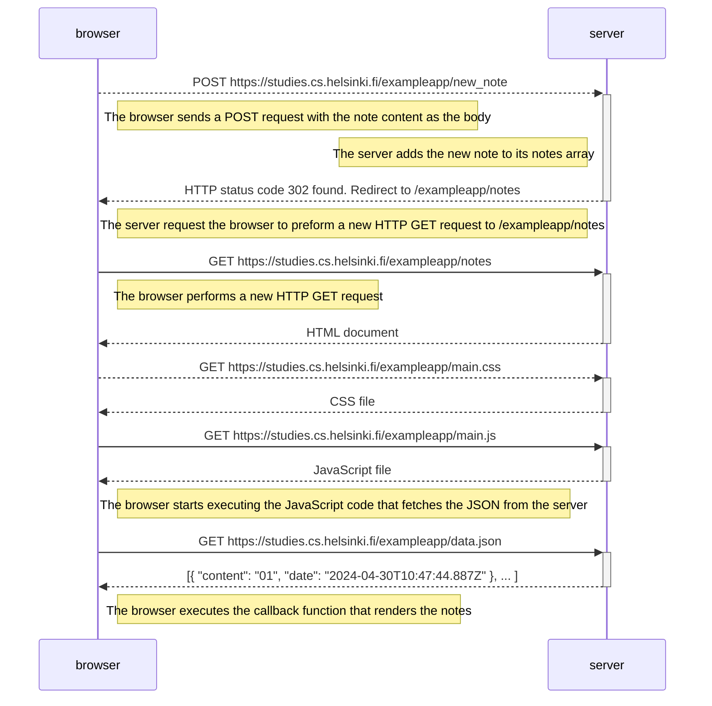

```mermaid
sequenceDiagram
    participant browser
    participant server

    browser-->>+server: POST https://studies.cs.helsinki.fi/exampleapp/new_note
    Note right of browser: The browser sends a POST request with the note content as the body
    Note left of server: The server adds the new note to its notes array
    server-->>-browser: HTTP status code 302 found. Redirect to /exampleapp/notes

    Note left of server: The server request the browser to preform a new HTTP GET request to /exampleapp/notes

    browser->>+server: GET https://studies.cs.helsinki.fi/exampleapp/notes
    Note right of browser: The browser performs a new HTTP GET request
    server-->>-browser: HTML document

    browser-->>+server: GET https://studies.cs.helsinki.fi/exampleapp/main.css
    server-->>-browser: CSS file


    browser->>+server: GET https://studies.cs.helsinki.fi/exampleapp/main.js
    server-->>-browser: JavaScript file

    Note right of browser: The browser starts executing the JavaScript code that fetches the JSON from the server

    browser->>+server: GET https://studies.cs.helsinki.fi/exampleapp/data.json
    server-->>-browser: [{ "content": "01", "date": "2024-04-30T10:47:44.887Z" }, ... ]

    Note right of browser: The browser executes the callback function that renders the notes
```
