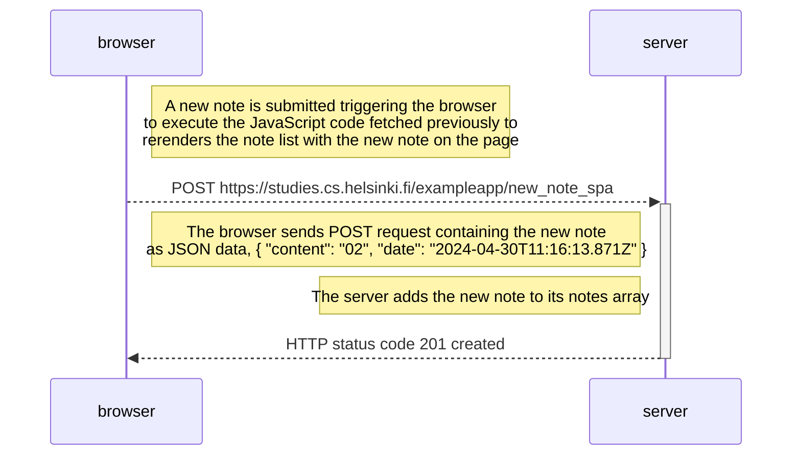

```mermaid
sequenceDiagram

participant browser
participant server

Note right of browser: A new note is submitted triggering the browser <br> to execute the JavaScript code fetched previously to <br>rerenders the note list with the new note on the page

browser-->>+server: POST https://studies.cs.helsinki.fi/exampleapp/new_note_spa


Note right of browser: The browser sends POST request containing the new note <br>as JSON data, { "content": "02", "date": "2024-04-30T11:16:13.871Z" }

 Note left of server: The server adds the new note to its notes array

server-->>-browser: HTTP status code 201 created


```
